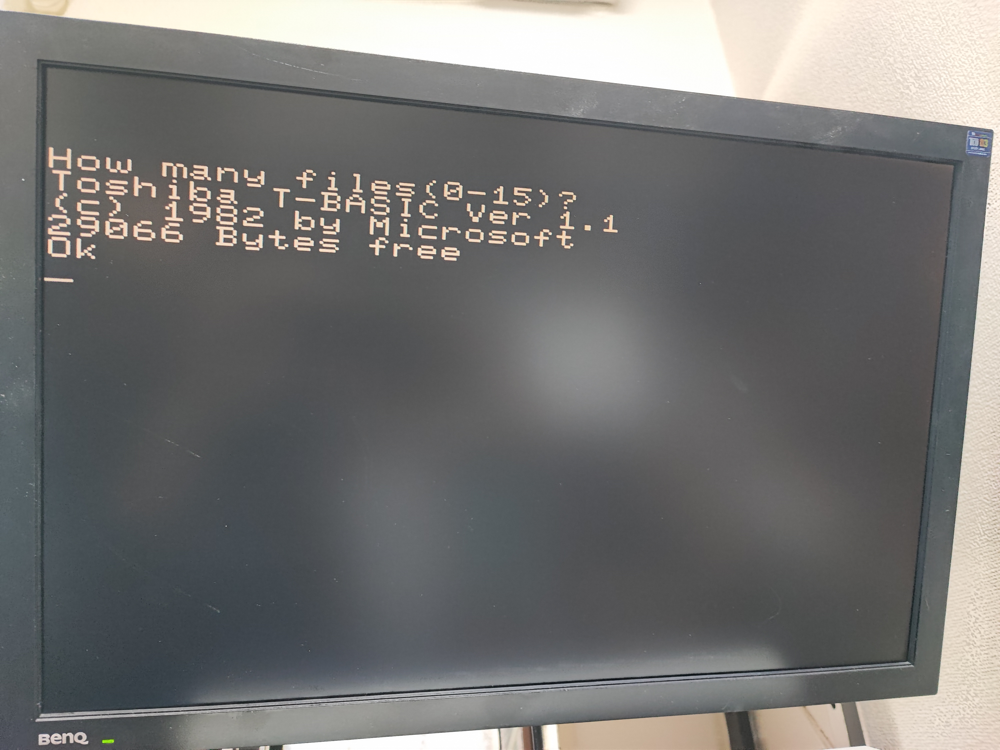
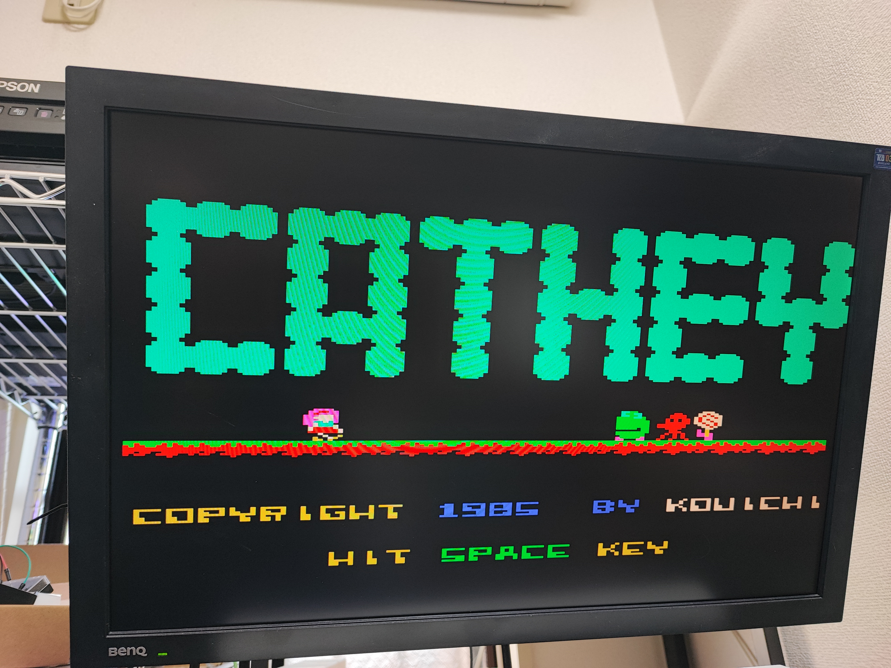
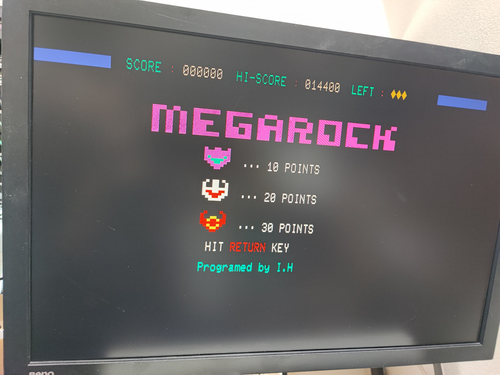

PASOPIA Emulator for Raspberry Pi Pico
---



Toshiba PASOPIA PA-7010 のエミュレータです。
以下の機能を実装しています。

- メイン RAM(64KB)
- ~~テープ~~
- PAC2

T-BASIC (Version 1.1) で起動を確認していますが、OA-BASIC や MINI-PASCAL の動作は未確認です。

---
# 配線

Pico と VGA コネクタやブザー/スピーカーなどを以下のように配線します。

- GPIO0 VGA:H-SYNC
- GPIO1 VGA:V-SYNC
- GPIO2 VGA:Blue
- GPIO3 VGA:Red
- GPIO4 VGA:Green
- GPIO6 Audio

VGA の色信号を VGA コネクタの間には 270~330 Ohm 程度の抵抗を直列に入れてください。
このほかに VGA、Audio の　GND に Pico の　GND を接続してください。

---
# ROM など

著作権の関係で ROM は含まれていません。

ROM ファイルを Pico に置きます。

picotool を使う場合は、以下の通りで行けると思います。
(picotool は pico-sdk に含まれています)

```
$ picotool load -v -x tbasic.rom -t bin -o 0x10050000
$ picotool load -v -x font.rom -t bin -o 0x10058000
```

ROM を書き込んだのちに `prebuild` ディレクトリ以下にある uf2 ファイルを書き込むと起動します。

---
# キーボード

Pico の USB 端子に、OTG ケーブルなどを介して USB キーボードを接続します。
USB キーボードに存在しないキーは以下のように割り当てています。

- (STOP) → Pause/Brak
- (COPY) → PrintScreen 
- KANJI → PageDown
- LABEL → PageUp

- カナ → カタカナ・ひらがな
- GRAPH → ALT

また F12 でメニュー画面に移ります。
テープイメージの操作ができます。

---
# テープ

LittleFS の扱い方については、
[こちらの記事を参照](https://shippoiincho.github.io/posts/39/)してください。


---
# PAC2

テープの動作が不安定なために、PAC2 で RAMPAC をサポートしました。
32KB の PAC として動作します。

RAMPAC は取り外し時にフラッシュに書き込みを行いますので、Pico のリセットをすると内容が消えますのでご注意ください。

エミュレータの動作中に　PAC の内容を切り替えることも可能です。

---
# 制限事項
- 20行モードの動作は未確認です
- CRTC を制御しているソフトは正しく表示されないことがあります
- SOUND 命令が音痴です
- テープの読み込みが不安定です
- 漢字 PAC の動作は未確認です

---
# ライセンスなど

このエミュレータは以下のライブラリを使用しています。

- [Z80](https://github.com/redcode/Z80/tree/master)
- [Zeta](https://github.com/redcode/Zeta)
- [VGA ライブラリ(一部改変)](https://github.com/vha3/Hunter-Adams-RP2040-Demos/tree/master/VGA_Graphics)
- [LittleFS](https://github.com/littlefs-project/littlefs)
- [pico-extras](https://github.com/raspberrypi/pico-extras)
- [HID Parser(おそらくLUFAの改変)](https://gist.github.com/SelvinPL/99fd9af4566e759b6553e912b6a163f9)

---
# Gallary



